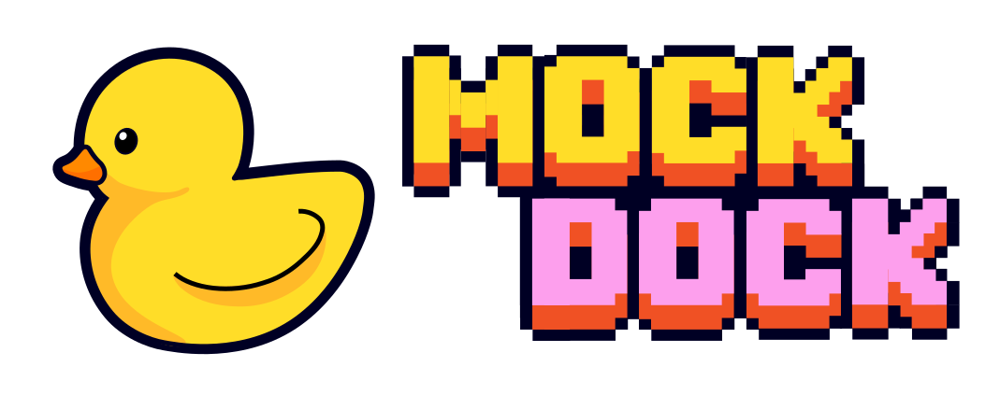

# MOCKDOCK

<p align="center">
  
</p>

**mockdock** is a docking-based benchmarking package for chemical language models (CLMs) and generative algorithms performing fragment-constrained molecular design. Each benchmark pairs a curated PDB crystal structure with bioactivity-annotated compounds, evaluating models on their ability to decorate core fragments into high-scoring molecules while maintaining a similar binding mode.

**Documentation:** [https://popov-lab-unc.github.io/mockdock/](https://popov-lab-unc.github.io/mockdock/) &nbsp;|&nbsp; **License:** [MIT](./LICENSE)

## Installation

### 1. Install AutoDock-GPU (Required, v1.6)

Install [AutoDock-GPU](https://github.com/ccsb-scripps/AutoDock-GPU) (tested with **v1.6**) by downloading a pre-compiled binary from [GitHub Releases](https://github.com/ccsb-scripps/AutoDock-GPU/releases) or building from source.

Ensure `adgpu` is in your `PATH`, or set its location via:
```bash
export ADGPU_EXECUTABLE=/path/to/adgpu
```

### 2. Install mockdock

```bash
git clone https://github.com/Popov-Lab-UNC/mockdock.git
cd mockdock
pip install -e .
```

Or using [uv](https://github.com/astral-sh/uv):

```bash
git clone https://github.com/Popov-Lab-UNC/mockdock.git
cd mockdock
uv venv && uv sync
```

## Quickstart

### Scoring with the Oracle

```python
from mockdock import MDOracle

# Initialize oracle for a benchmark target
oracle = MDOracle("CHK1", budget=1000, run_dir="./my_run")

# Seed compounds & required 2D fragment
initial_df = oracle.get_initial_compounds()
fragment_smiles = oracle.fragment_smiles

# Score candidate molecules (returns {smiles: reward_score in [0.0, 1.0]})
scores = oracle.score(["CCO", "c1ccccc1"])

# Inspect results (automatically saved to oracle.run_dir / "results.csv")
print(oracle.results_df)       # Full Polars history DataFrame
print(oracle.budget_remaining) # Remaining oracle calls

# Optionally save results explicitly
oracle.results_df.write_csv("results.csv")
```

### Post-hoc Evaluation

```python
from mockdock import MDEvaluator

evaluator = MDEvaluator("CHK1")
metrics = evaluator.compute_metrics("my_run/results.csv")

print(metrics["avg_top_10"])            # Top-10 mean reward score
print(metrics["fraction_medchem_pass"])  # MedChem filter pass rate
print(metrics["novelty"])               # Novelty fraction vs seed set
```

## Available Benchmarks

| Benchmark | Target ID | PDB ID | Reference Ligand | Calibration Bounds |
|-----------|-----------|--------|------------------|-------------------|
| **CHK1**  | CHEMBL4630 | 2R0U   | M54             | [-6.44, -11.79]   |
| **DPP4**  | CHEMBL284  | 2HHA   | 3TP             | [-6.21, -11.23]   |
| **ITK**   | CHEMBL2959 | 3QGW   | L7A             | [-6.55, -11.45]   |
| **PEPCK** | CHEMBL2911 | 2GMV   | UN8             | [-6.12, -10.98]   |
| **PptT**  | CHEMBL5465373 | 8GKF | D16            | [-6.30, -11.50]   |
| **TTK**   | CHEMBL3983 | 3WZJ   | O43             | [-6.48, -11.62]   |
| **VEGFR2**| CHEMBL279  | 3VHE   | 42Q             | [-6.70, -12.10]   |

*See the [documentation](https://popov-lab-unc.github.io/mockdock/) for scoring mechanics, adding custom targets, script pipelines, and full API reference.*