# Chemical Property & Docking Score Correlation Analysis

This report investigates the correlation between **Normalized Docking Scores** and key physical-chemical descriptors: **Molecular Weight (MW)** and **Octanol-Water Partition Coefficient (LogP)**. 
Additionally, we evaluate how the distribution of these properties differs between **Generated Molecules** (specifically those with a positive docking normalization score $>0.0$) and the corresponding biological target's **Reference Set** (from target ChEMBL bioactivity baseline).

---

## 1. Overview of Key Findings

Historically, generative models optimizing solely for docking score can fall into the trap of "optimizing for size or lipophilicity," because larger and more lipophilic compounds can make non-specific, hydrophobic contacts in a binding pocket, leading to artificially inflated binding energy scores. 

By analyzing the correlation coefficient (Pearson $r$) and looking at the distributions, we can check:
1. **Size Bias**: Do generated molecules have systematically larger Molecular Weights than known active reference compounds?
2. **Lipophilicity Bias**: Do they display abnormally high LogP values?
3. **Descriptor-Docking Correlation**: Is there a strong linear correlation between molecular properties and docking scores in the generated vs. reference sets?

### Reporting Pearson $r$ vs $R^2$ (Coefficient of Determination)
For diagnostic evaluation of descriptor bias, reporting the Pearson correlation coefficient ($r$) is preferred over $R^2$ due to two primary statistical reasons:
1. **Preservation of Direction**: Pearson $r$ ranges from $[-1, 1]$, where the sign indicates the *direction* of the relationship. A positive $r$ directly shows that higher molecular weight or lipophilicity is associated with higher docking scores (positive bias). $R^2$ is bounded $[0, 1]$ and discards directionality, making it impossible to distinguish between size creep (positive correlation) and size reduction (negative correlation).
2. **Linear Association Strength**: Pearson $r$ measures the strength of the linear association, which is the direct metric of interest when diagnosing size/hydrophobic biases in docking scoring functions. $R^2$ describes the proportion of explained variance, which is more applicable to predictive regression modelling than bivariate correlation analysis.

---

## 2. Correlation & Distribution Analysis by Target

### Target: CHK1

#### Property Distributions (Reference vs Generated)
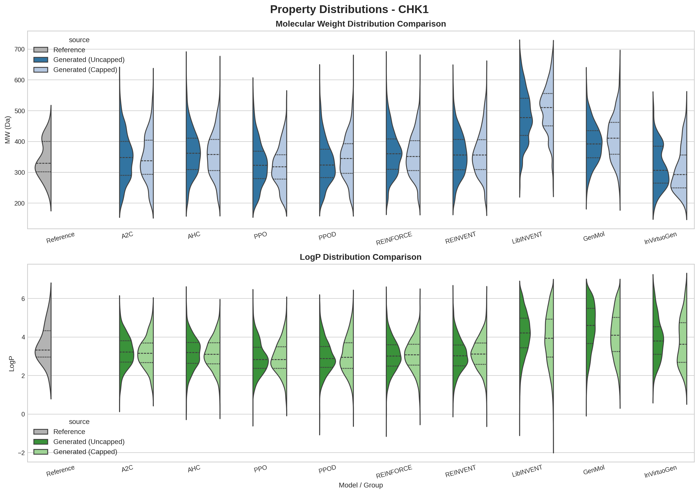

#### Correlation Scatter Plots (MW & LogP vs Normalized Docking Score)
````carousel
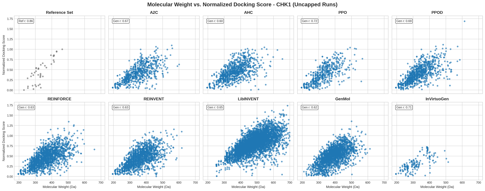
<!-- slide -->
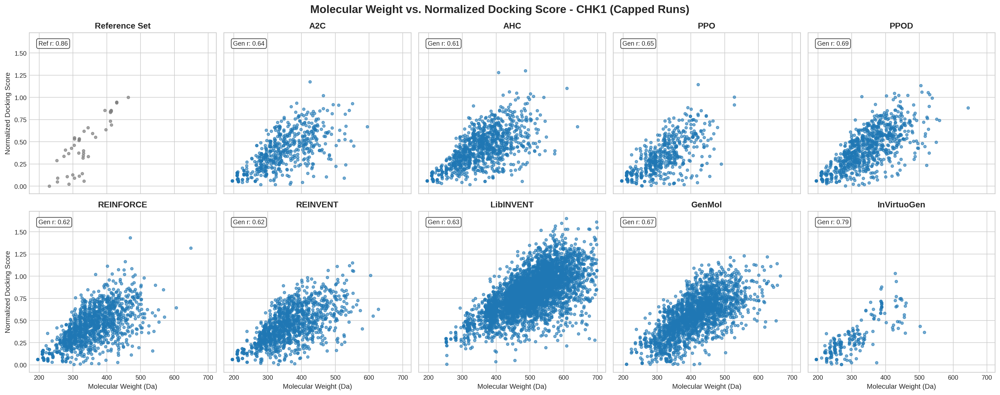
<!-- slide -->
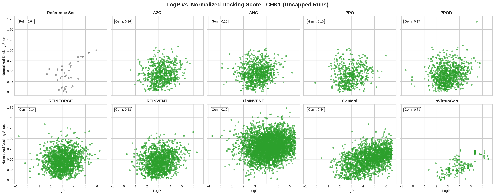
<!-- slide -->
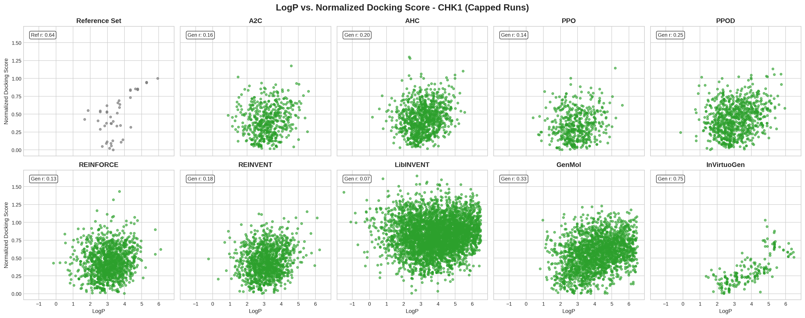
````

#### Statistics Summary
| Model | Experiment Type | N (Gen > 0) | Mean MW (Gen) | Mean MW (Ref) | Mean LogP (Gen) | Mean LogP (Ref) | MW Correlation (Gen r) | MW Correlation (Ref r) | LogP Correlation (Gen r) | LogP Correlation (Ref r) |
| :--- | :--- | :---: | :---: | :---: | :---: | :---: | :---: | :---: | :---: | :---: |
| A2C | Capped | 540 | 346.2 | 339.7 | 3.19 | 3.58 | 0.64 | 0.86 | 0.16 | 0.64 |
| A2C | Uncapped | 661 | 349.8 | 339.7 | 3.25 | 3.58 | 0.67 | 0.86 | 0.16 | 0.64 |
| AHC | Capped | 983 | 359.2 | 339.7 | 3.15 | 3.58 | 0.61 | 0.86 | 0.20 | 0.64 |
| AHC | Uncapped | 875 | 364.4 | 339.7 | 3.17 | 3.58 | 0.60 | 0.86 | 0.10 | 0.64 |
| PPO | Capped | 509 | 319.2 | 339.7 | 2.92 | 3.58 | 0.65 | 0.86 | 0.14 | 0.64 |
| PPO | Uncapped | 519 | 327.3 | 339.7 | 2.93 | 3.58 | 0.72 | 0.86 | 0.15 | 0.64 |
| PPOD | Capped | 844 | 346.6 | 339.7 | 3.06 | 3.58 | 0.69 | 0.86 | 0.25 | 0.64 |
| PPOD | Uncapped | 901 | 334.0 | 339.7 | 2.99 | 3.58 | 0.69 | 0.86 | 0.17 | 0.64 |
| REINFORCE | Capped | 1255 | 356.7 | 339.7 | 3.07 | 3.58 | 0.62 | 0.86 | 0.13 | 0.64 |
| REINFORCE | Uncapped | 1706 | 364.7 | 339.7 | 3.05 | 3.58 | 0.63 | 0.86 | 0.14 | 0.64 |
| REINVENT | Capped | 1222 | 362.4 | 339.7 | 3.14 | 3.58 | 0.62 | 0.86 | 0.18 | 0.64 |
| REINVENT | Uncapped | 1495 | 359.9 | 339.7 | 3.07 | 3.58 | 0.63 | 0.86 | 0.18 | 0.64 |
| LibINVENT | Capped | 4232 | 503.4 | 339.7 | 3.91 | 3.58 | 0.63 | 0.86 | 0.07 | 0.64 |
| LibINVENT | Uncapped | 4205 | 481.3 | 339.7 | 4.20 | 3.58 | 0.65 | 0.86 | 0.12 | 0.64 |
| GenMol | Capped | 2058 | 413.6 | 339.7 | 4.11 | 3.58 | 0.67 | 0.86 | 0.33 | 0.64 |
| GenMol | Uncapped | 1921 | 393.0 | 339.7 | 4.52 | 3.58 | 0.62 | 0.86 | 0.44 | 0.64 |
| InVirtuoGen | Capped | 203 | 307.4 | 339.7 | 3.76 | 3.58 | 0.79 | 0.86 | 0.75 | 0.64 |
| InVirtuoGen | Uncapped | 171 | 317.7 | 339.7 | 3.90 | 3.58 | 0.71 | 0.86 | 0.71 | 0.64 |

---

### Target: DPP4

#### Property Distributions (Reference vs Generated)
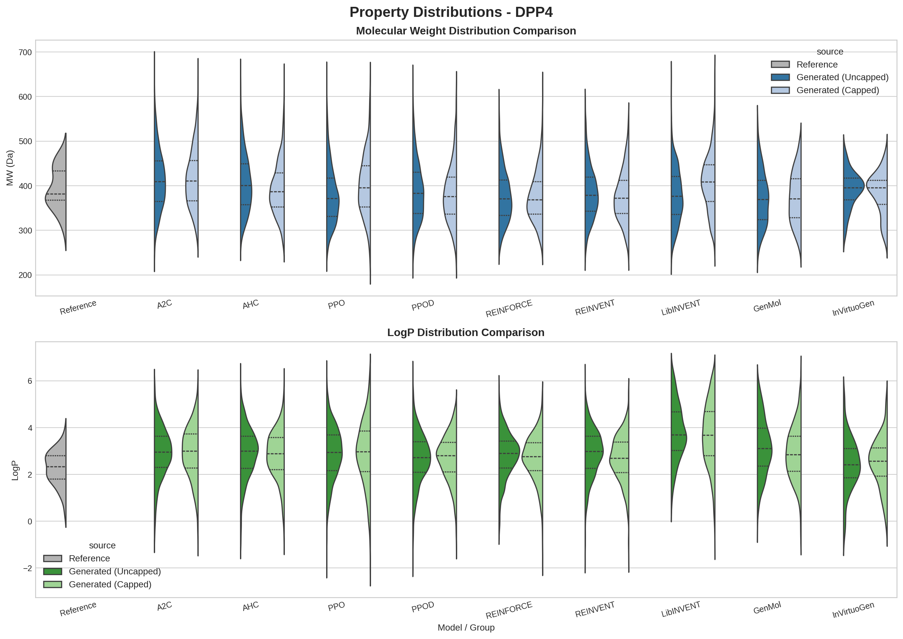

#### Correlation Scatter Plots (MW & LogP vs Normalized Docking Score)
````carousel
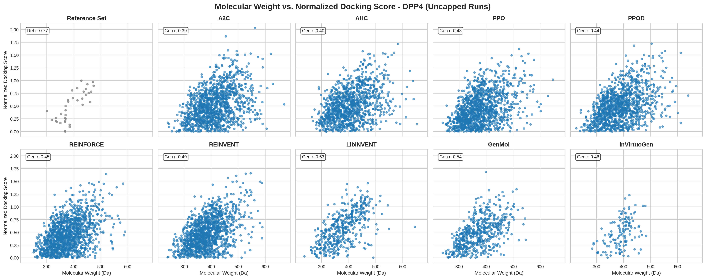
<!-- slide -->
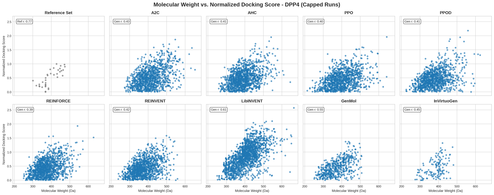
<!-- slide -->
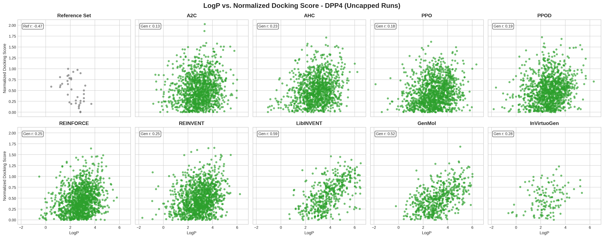
<!-- slide -->
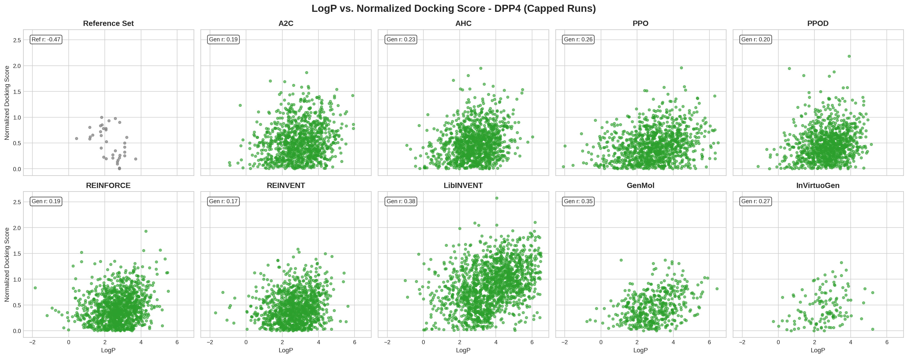
````

#### Statistics Summary
| Model | Experiment Type | N (Gen > 0) | Mean MW (Gen) | Mean MW (Ref) | Mean LogP (Gen) | Mean LogP (Ref) | MW Correlation (Gen r) | MW Correlation (Ref r) | LogP Correlation (Gen r) | LogP Correlation (Ref r) |
| :--- | :--- | :---: | :---: | :---: | :---: | :---: | :---: | :---: | :---: | :---: |
| A2C | Capped | 1047 | 415.6 | 394.0 | 2.95 | 2.28 | 0.43 | 0.77 | 0.19 | -0.47 |
| A2C | Uncapped | 1281 | 413.3 | 394.0 | 2.93 | 2.28 | 0.39 | 0.77 | 0.13 | -0.47 |
| AHC | Capped | 1181 | 393.3 | 394.0 | 2.84 | 2.28 | 0.41 | 0.77 | 0.23 | -0.47 |
| AHC | Uncapped | 1148 | 406.5 | 394.0 | 2.92 | 2.28 | 0.40 | 0.77 | 0.23 | -0.47 |
| PPO | Capped | 1080 | 401.1 | 394.0 | 2.93 | 2.28 | 0.40 | 0.77 | 0.26 | -0.47 |
| PPO | Uncapped | 1278 | 379.9 | 394.0 | 2.91 | 2.28 | 0.43 | 0.77 | 0.18 | -0.47 |
| PPOD | Capped | 1050 | 381.9 | 394.0 | 2.71 | 2.28 | 0.41 | 0.77 | 0.20 | -0.47 |
| PPOD | Uncapped | 1221 | 388.2 | 394.0 | 2.68 | 2.28 | 0.44 | 0.77 | 0.19 | -0.47 |
| REINFORCE | Capped | 1209 | 375.1 | 394.0 | 2.72 | 2.28 | 0.39 | 0.77 | 0.19 | -0.47 |
| REINFORCE | Uncapped | 1387 | 376.5 | 394.0 | 2.83 | 2.28 | 0.45 | 0.77 | 0.25 | -0.47 |
| REINVENT | Capped | 1166 | 376.7 | 394.0 | 2.69 | 2.28 | 0.42 | 0.77 | 0.17 | -0.47 |
| REINVENT | Uncapped | 1340 | 384.4 | 394.0 | 2.92 | 2.28 | 0.49 | 0.77 | 0.25 | -0.47 |
| LibINVENT | Capped | 1601 | 407.7 | 394.0 | 3.69 | 2.28 | 0.61 | 0.77 | 0.38 | -0.47 |
| LibINVENT | Uncapped | 479 | 378.3 | 394.0 | 3.83 | 2.28 | 0.63 | 0.77 | 0.59 | -0.47 |
| GenMol | Capped | 492 | 373.7 | 394.0 | 2.90 | 2.28 | 0.55 | 0.77 | 0.35 | -0.47 |
| GenMol | Uncapped | 564 | 372.3 | 394.0 | 3.18 | 2.28 | 0.54 | 0.77 | 0.52 | -0.47 |
| InVirtuoGen | Capped | 134 | 384.2 | 394.0 | 2.51 | 2.28 | 0.45 | 0.77 | 0.27 | -0.47 |
| InVirtuoGen | Uncapped | 134 | 391.2 | 394.0 | 2.44 | 2.28 | 0.46 | 0.77 | 0.28 | -0.47 |

---

### Target: ITK

#### Property Distributions (Reference vs Generated)
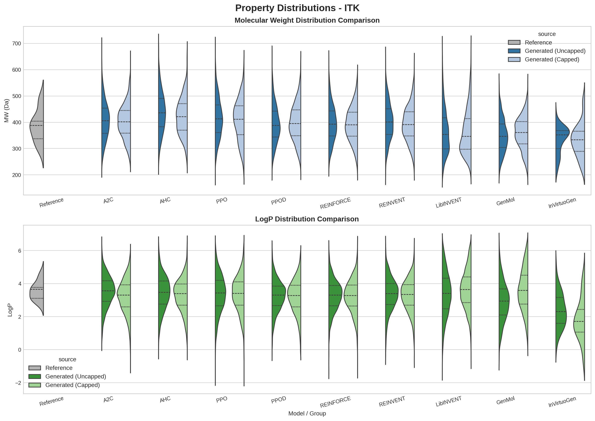

#### Correlation Scatter Plots (MW & LogP vs Normalized Docking Score)
````carousel
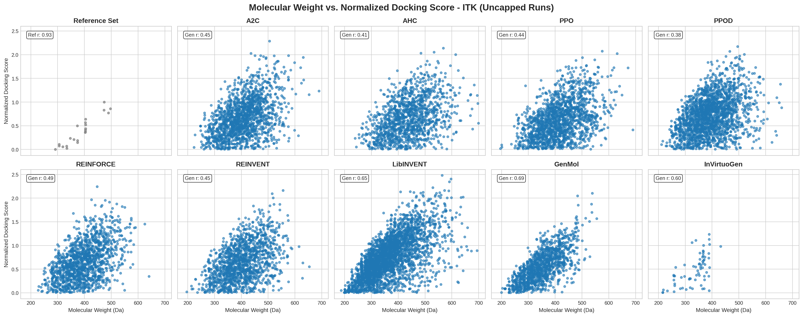
<!-- slide -->
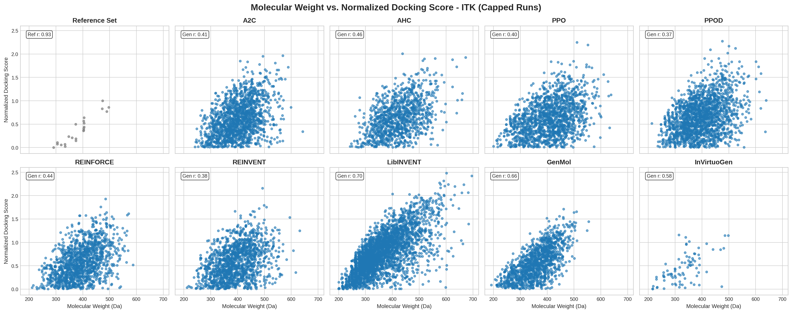
<!-- slide -->
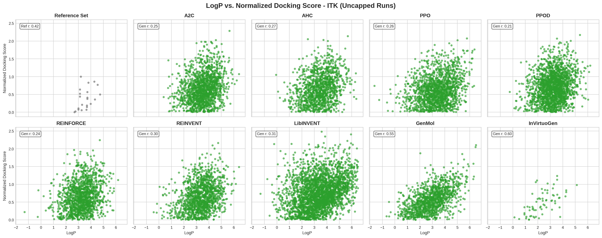
<!-- slide -->
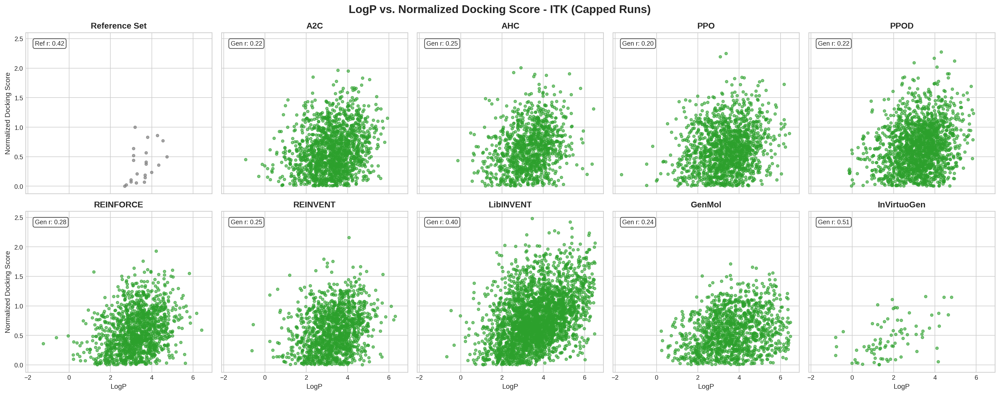
````

#### Statistics Summary
| Model | Experiment Type | N (Gen > 0) | Mean MW (Gen) | Mean MW (Ref) | Mean LogP (Gen) | Mean LogP (Ref) | MW Correlation (Gen r) | MW Correlation (Ref r) | LogP Correlation (Gen r) | LogP Correlation (Ref r) |
| :--- | :--- | :---: | :---: | :---: | :---: | :---: | :---: | :---: | :---: | :---: |
| A2C | Capped | 1537 | 402.8 | 385.4 | 3.25 | 3.56 | 0.41 | 0.93 | 0.22 | 0.42 |
| A2C | Uncapped | 1553 | 407.8 | 385.4 | 3.53 | 3.56 | 0.45 | 0.93 | 0.25 | 0.42 |
| AHC | Capped | 1088 | 422.2 | 385.4 | 3.32 | 3.56 | 0.46 | 0.93 | 0.25 | 0.42 |
| AHC | Uncapped | 1281 | 438.8 | 385.4 | 3.43 | 3.56 | 0.41 | 0.93 | 0.27 | 0.42 |
| PPO | Capped | 1501 | 408.5 | 385.4 | 3.38 | 3.56 | 0.40 | 0.93 | 0.20 | 0.42 |
| PPO | Uncapped | 1643 | 416.8 | 385.4 | 3.39 | 3.56 | 0.44 | 0.93 | 0.26 | 0.42 |
| PPOD | Capped | 1767 | 399.4 | 385.4 | 3.22 | 3.56 | 0.37 | 0.93 | 0.22 | 0.42 |
| PPOD | Uncapped | 2005 | 394.9 | 385.4 | 3.26 | 3.56 | 0.38 | 0.93 | 0.21 | 0.42 |
| REINFORCE | Capped | 1310 | 392.7 | 385.4 | 3.25 | 3.56 | 0.44 | 0.93 | 0.28 | 0.42 |
| REINFORCE | Uncapped | 1397 | 396.5 | 385.4 | 3.27 | 3.56 | 0.49 | 0.93 | 0.24 | 0.42 |
| REINVENT | Capped | 1385 | 393.8 | 385.4 | 3.30 | 3.56 | 0.38 | 0.93 | 0.25 | 0.42 |
| REINVENT | Uncapped | 1395 | 403.8 | 385.4 | 3.35 | 3.56 | 0.45 | 0.93 | 0.30 | 0.42 |
| LibINVENT | Capped | 3091 | 362.0 | 385.4 | 3.65 | 3.56 | 0.70 | 0.93 | 0.40 | 0.42 |
| LibINVENT | Uncapped | 3053 | 365.1 | 385.4 | 3.39 | 3.56 | 0.65 | 0.93 | 0.31 | 0.42 |
| GenMol | Capped | 1314 | 359.5 | 385.4 | 3.63 | 3.56 | 0.66 | 0.93 | 0.24 | 0.42 |
| GenMol | Uncapped | 1243 | 350.1 | 385.4 | 2.92 | 3.56 | 0.69 | 0.93 | 0.55 | 0.42 |
| InVirtuoGen | Capped | 82 | 331.8 | 385.4 | 1.85 | 3.56 | 0.58 | 0.93 | 0.51 | 0.42 |
| InVirtuoGen | Uncapped | 67 | 334.3 | 385.4 | 2.37 | 3.56 | 0.60 | 0.93 | 0.60 | 0.42 |

---

### Target: PEPCK

#### Property Distributions (Reference vs Generated)
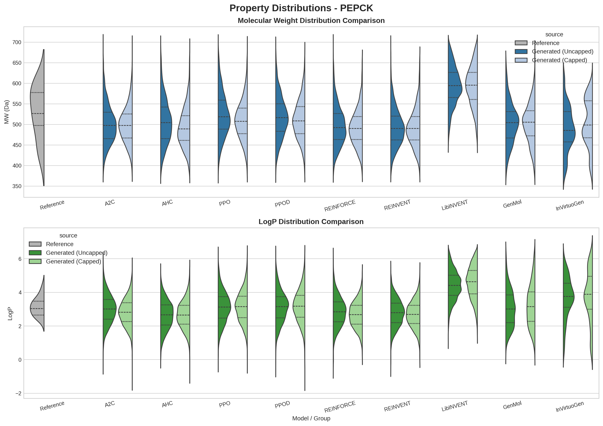

#### Correlation Scatter Plots (MW & LogP vs Normalized Docking Score)
````carousel
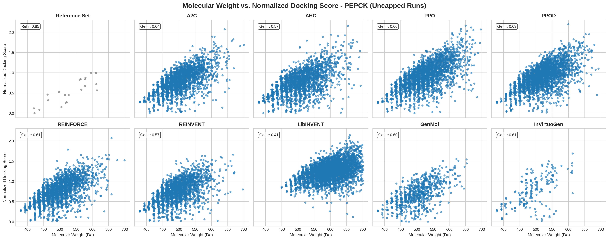
<!-- slide -->
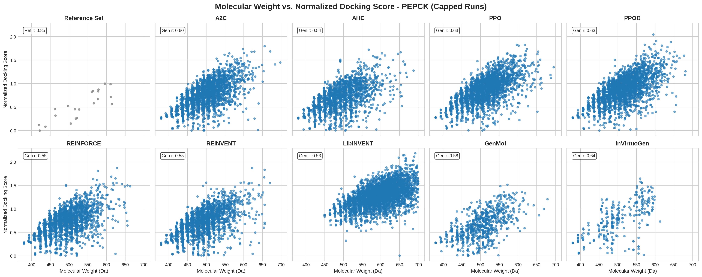
<!-- slide -->
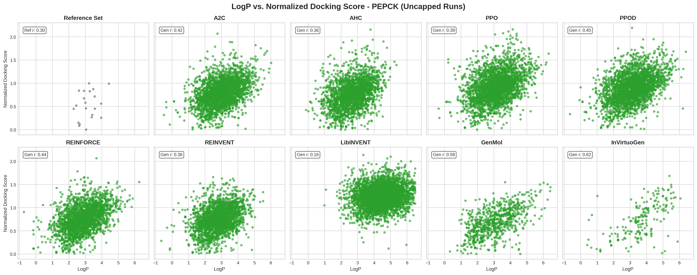
<!-- slide -->
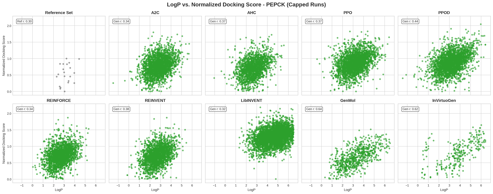
````

#### Statistics Summary
| Model | Experiment Type | N (Gen > 0) | Mean MW (Gen) | Mean MW (Ref) | Mean LogP (Gen) | Mean LogP (Ref) | MW Correlation (Gen r) | MW Correlation (Ref r) | LogP Correlation (Gen r) | LogP Correlation (Ref r) |
| :--- | :--- | :---: | :---: | :---: | :---: | :---: | :---: | :---: | :---: | :---: |
| A2C | Capped | 2698 | 500.0 | 530.5 | 2.83 | 3.16 | 0.60 | 0.85 | 0.34 | 0.30 |
| A2C | Uncapped | 2761 | 501.3 | 530.5 | 3.01 | 3.16 | 0.64 | 0.85 | 0.42 | 0.30 |
| AHC | Capped | 1941 | 493.2 | 530.5 | 2.68 | 3.16 | 0.54 | 0.85 | 0.37 | 0.30 |
| AHC | Uncapped | 2302 | 507.5 | 530.5 | 2.66 | 3.16 | 0.57 | 0.85 | 0.36 | 0.30 |
| PPO | Capped | 2719 | 511.2 | 530.5 | 3.16 | 3.16 | 0.63 | 0.85 | 0.37 | 0.30 |
| PPO | Uncapped | 2855 | 523.2 | 530.5 | 3.12 | 3.16 | 0.66 | 0.85 | 0.39 | 0.30 |
| PPOD | Capped | 2851 | 512.5 | 530.5 | 3.19 | 3.16 | 0.63 | 0.85 | 0.44 | 0.30 |
| PPOD | Uncapped | 2940 | 518.5 | 530.5 | 3.14 | 3.16 | 0.63 | 0.85 | 0.45 | 0.30 |
| REINFORCE | Capped | 2395 | 492.0 | 530.5 | 2.69 | 3.16 | 0.55 | 0.85 | 0.34 | 0.30 |
| REINFORCE | Uncapped | 2469 | 497.0 | 530.5 | 2.86 | 3.16 | 0.61 | 0.85 | 0.44 | 0.30 |
| REINVENT | Capped | 2412 | 492.2 | 530.5 | 2.71 | 3.16 | 0.55 | 0.85 | 0.38 | 0.30 |
| REINVENT | Uncapped | 2458 | 493.6 | 530.5 | 2.79 | 3.16 | 0.57 | 0.85 | 0.36 | 0.30 |
| LibINVENT | Capped | 4168 | 594.0 | 530.5 | 4.58 | 3.16 | 0.53 | 0.85 | 0.32 | 0.30 |
| LibINVENT | Uncapped | 4341 | 594.8 | 530.5 | 4.42 | 3.16 | 0.41 | 0.85 | 0.16 | 0.30 |
| GenMol | Capped | 766 | 503.2 | 530.5 | 3.23 | 3.16 | 0.58 | 0.85 | 0.64 | 0.30 |
| GenMol | Uncapped | 776 | 503.1 | 530.5 | 3.05 | 3.16 | 0.60 | 0.85 | 0.58 | 0.30 |
| InVirtuoGen | Capped | 285 | 503.1 | 530.5 | 3.78 | 3.16 | 0.64 | 0.85 | 0.62 | 0.30 |
| InVirtuoGen | Uncapped | 190 | 489.2 | 530.5 | 3.71 | 3.16 | 0.61 | 0.85 | 0.62 | 0.30 |

---

### Target: PptT

#### Property Distributions (Reference vs Generated)
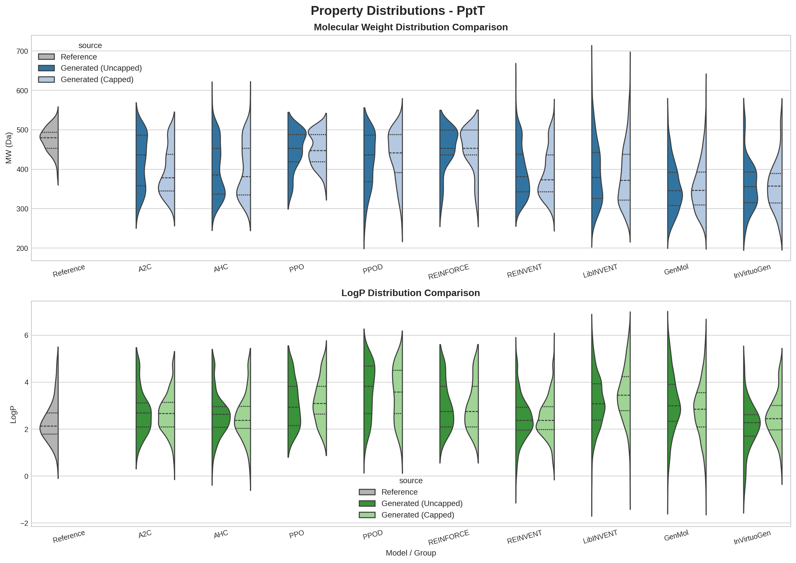

#### Correlation Scatter Plots (MW & LogP vs Normalized Docking Score)
````carousel
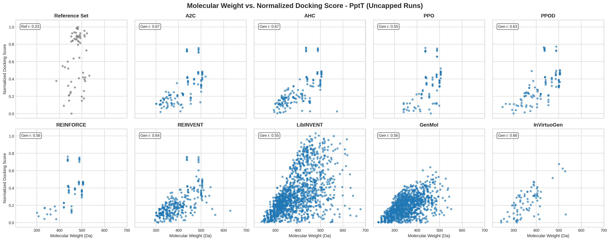
<!-- slide -->
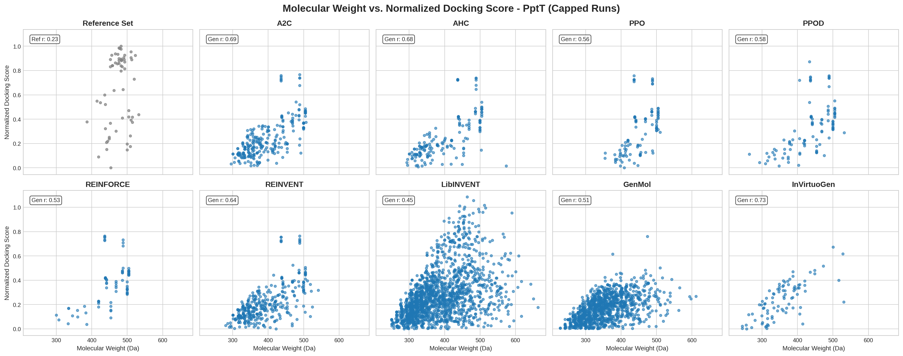
<!-- slide -->
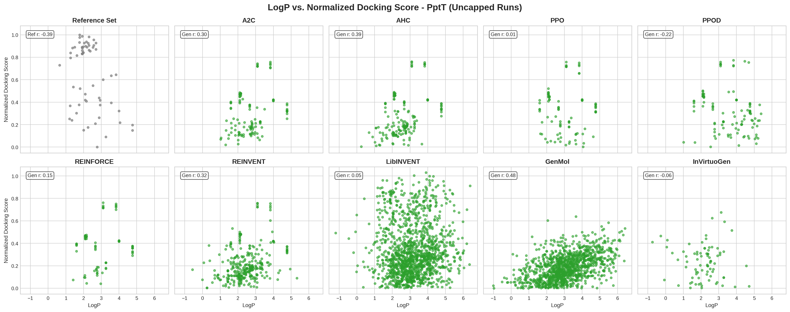
<!-- slide -->
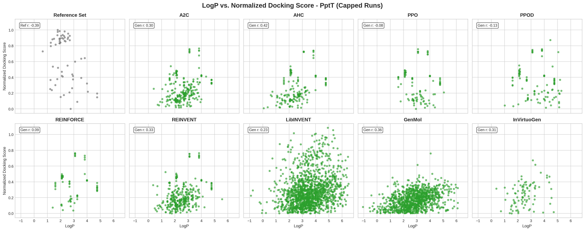
````

#### Statistics Summary
| Model | Experiment Type | N (Gen > 0) | Mean MW (Gen) | Mean MW (Ref) | Mean LogP (Gen) | Mean LogP (Ref) | MW Correlation (Gen r) | MW Correlation (Ref r) | LogP Correlation (Gen r) | LogP Correlation (Ref r) |
| :--- | :--- | :---: | :---: | :---: | :---: | :---: | :---: | :---: | :---: | :---: |
| A2C | Capped | 252 | 393.9 | 475.7 | 2.67 | 2.32 | 0.69 | 0.23 | 0.30 | -0.39 |
| A2C | Uncapped | 117 | 419.4 | 475.7 | 2.73 | 2.32 | 0.67 | 0.23 | 0.30 | -0.39 |
| AHC | Capped | 165 | 398.4 | 475.7 | 2.52 | 2.32 | 0.68 | 0.23 | 0.42 | -0.39 |
| AHC | Uncapped | 164 | 399.8 | 475.7 | 2.59 | 2.32 | 0.67 | 0.23 | 0.39 | -0.39 |
| PPO | Capped | 101 | 450.6 | 475.7 | 3.16 | 2.32 | 0.56 | 0.23 | -0.08 | -0.39 |
| PPO | Uncapped | 88 | 449.0 | 475.7 | 3.06 | 2.32 | 0.55 | 0.23 | 0.01 | -0.39 |
| PPOD | Capped | 101 | 434.9 | 475.7 | 3.48 | 2.32 | 0.58 | 0.23 | -0.13 | -0.39 |
| PPOD | Uncapped | 109 | 421.2 | 475.7 | 3.60 | 2.32 | 0.63 | 0.23 | -0.22 | -0.39 |
| REINFORCE | Capped | 70 | 450.6 | 475.7 | 2.97 | 2.32 | 0.53 | 0.23 | 0.09 | -0.39 |
| REINFORCE | Uncapped | 71 | 451.2 | 475.7 | 2.99 | 2.32 | 0.56 | 0.23 | 0.15 | -0.39 |
| REINVENT | Capped | 363 | 389.1 | 475.7 | 2.48 | 2.32 | 0.64 | 0.23 | 0.33 | -0.39 |
| REINVENT | Uncapped | 327 | 393.5 | 475.7 | 2.45 | 2.32 | 0.64 | 0.23 | 0.32 | -0.39 |
| LibINVENT | Capped | 1622 | 384.3 | 475.7 | 3.51 | 2.32 | 0.45 | 0.23 | 0.23 | -0.39 |
| LibINVENT | Uncapped | 1428 | 389.1 | 475.7 | 3.16 | 2.32 | 0.55 | 0.23 | 0.05 | -0.39 |
| GenMol | Capped | 1112 | 355.5 | 475.7 | 2.82 | 2.32 | 0.51 | 0.23 | 0.36 | -0.39 |
| GenMol | Uncapped | 1206 | 352.3 | 475.7 | 3.10 | 2.32 | 0.56 | 0.23 | 0.48 | -0.39 |
| InVirtuoGen | Capped | 88 | 357.0 | 475.7 | 2.55 | 2.32 | 0.73 | 0.23 | 0.31 | -0.39 |
| InVirtuoGen | Uncapped | 79 | 358.0 | 475.7 | 2.13 | 2.32 | 0.66 | 0.23 | -0.06 | -0.39 |

---

### Target: TTK

#### Property Distributions (Reference vs Generated)
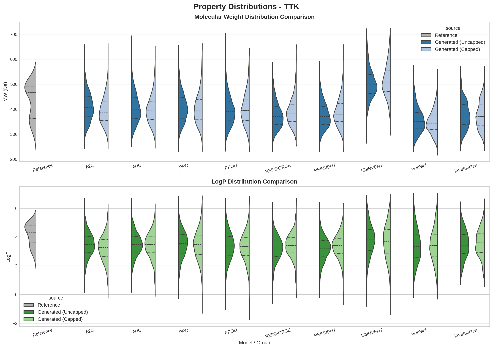

#### Correlation Scatter Plots (MW & LogP vs Normalized Docking Score)
````carousel
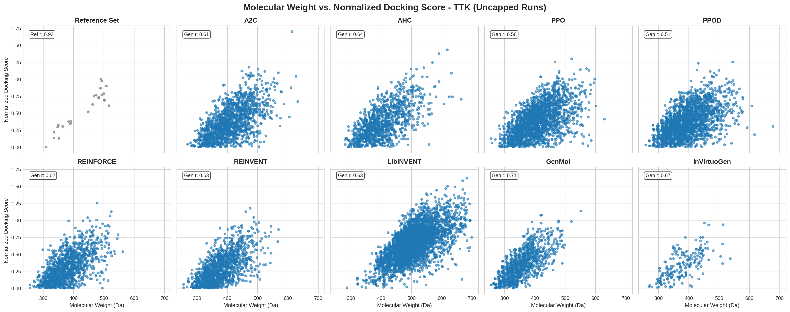
<!-- slide -->
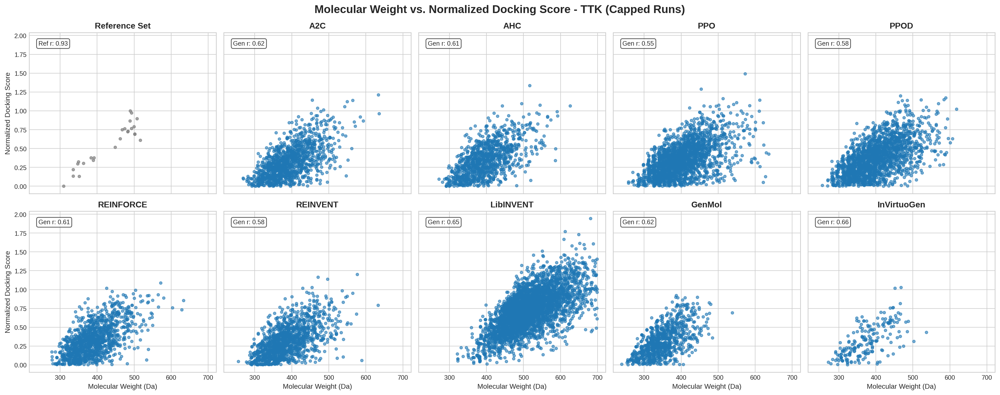
<!-- slide -->
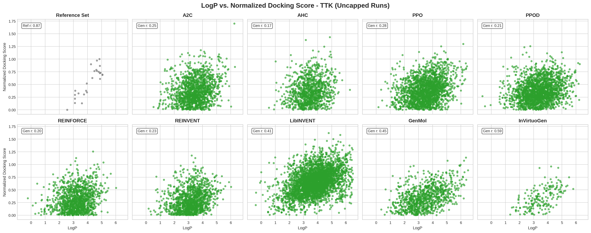
<!-- slide -->
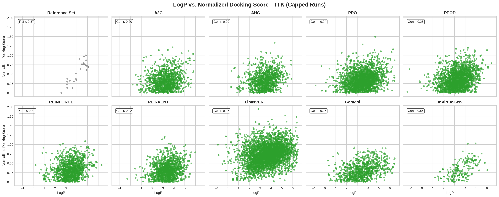
````

#### Statistics Summary
| Model | Experiment Type | N (Gen > 0) | Mean MW (Gen) | Mean MW (Ref) | Mean LogP (Gen) | Mean LogP (Ref) | MW Correlation (Gen r) | MW Correlation (Ref r) | LogP Correlation (Gen r) | LogP Correlation (Ref r) |
| :--- | :--- | :---: | :---: | :---: | :---: | :---: | :---: | :---: | :---: | :---: |
| A2C | Capped | 1175 | 394.9 | 434.6 | 3.23 | 4.15 | 0.62 | 0.93 | 0.20 | 0.87 |
| A2C | Uncapped | 1454 | 411.0 | 434.6 | 3.48 | 4.15 | 0.61 | 0.93 | 0.25 | 0.87 |
| AHC | Capped | 1066 | 399.2 | 434.6 | 3.44 | 4.15 | 0.61 | 0.93 | 0.20 | 0.87 |
| AHC | Uncapped | 1082 | 407.0 | 434.6 | 3.47 | 4.15 | 0.64 | 0.93 | 0.17 | 0.87 |
| PPO | Capped | 2071 | 403.3 | 434.6 | 3.46 | 4.15 | 0.55 | 0.93 | 0.24 | 0.87 |
| PPO | Uncapped | 2031 | 408.5 | 434.6 | 3.52 | 4.15 | 0.56 | 0.93 | 0.28 | 0.87 |
| PPOD | Capped | 1997 | 401.3 | 434.6 | 3.32 | 4.15 | 0.58 | 0.93 | 0.28 | 0.87 |
| PPOD | Uncapped | 2073 | 396.0 | 434.6 | 3.38 | 4.15 | 0.51 | 0.93 | 0.21 | 0.87 |
| REINFORCE | Capped | 1233 | 390.2 | 434.6 | 3.41 | 4.15 | 0.61 | 0.93 | 0.21 | 0.87 |
| REINFORCE | Uncapped | 1267 | 378.3 | 434.6 | 3.21 | 4.15 | 0.62 | 0.93 | 0.20 | 0.87 |
| REINVENT | Capped | 1315 | 388.3 | 434.6 | 3.38 | 4.15 | 0.58 | 0.93 | 0.22 | 0.87 |
| REINVENT | Uncapped | 1332 | 377.8 | 434.6 | 3.19 | 4.15 | 0.63 | 0.93 | 0.23 | 0.87 |
| LibINVENT | Capped | 3620 | 515.4 | 434.6 | 3.66 | 4.15 | 0.65 | 0.93 | 0.27 | 0.87 |
| LibINVENT | Uncapped | 3693 | 503.9 | 434.6 | 3.80 | 4.15 | 0.63 | 0.93 | 0.41 | 0.87 |
| GenMol | Capped | 902 | 348.7 | 434.6 | 3.43 | 4.15 | 0.62 | 0.93 | 0.36 | 0.87 |
| GenMol | Uncapped | 984 | 357.1 | 434.6 | 3.41 | 4.15 | 0.71 | 0.93 | 0.45 | 0.87 |
| InVirtuoGen | Capped | 197 | 376.0 | 434.6 | 3.59 | 4.15 | 0.66 | 0.93 | 0.56 | 0.87 |
| InVirtuoGen | Uncapped | 194 | 377.1 | 434.6 | 3.51 | 4.15 | 0.67 | 0.93 | 0.59 | 0.87 |

---

### Target: VEGFR2

#### Property Distributions (Reference vs Generated)
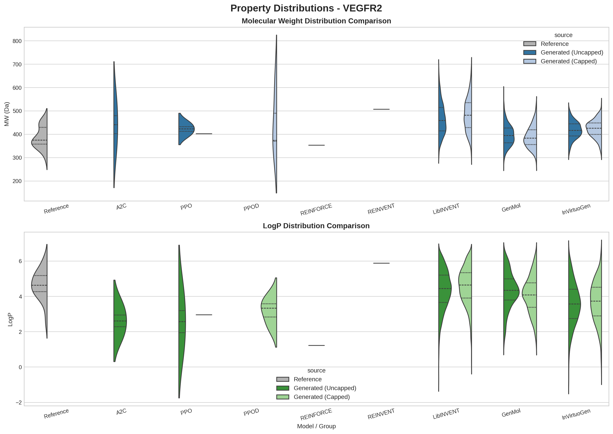

#### Correlation Scatter Plots (MW & LogP vs Normalized Docking Score)
````carousel
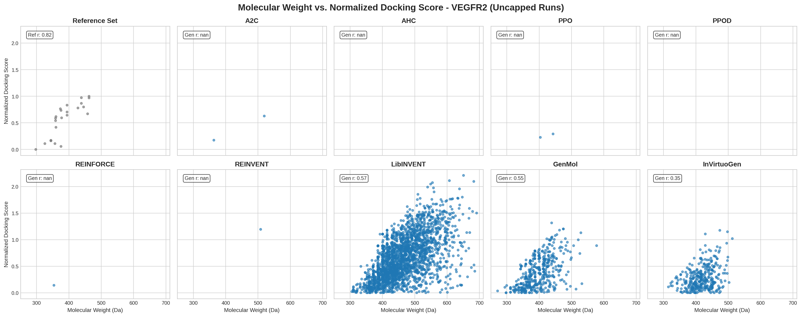
<!-- slide -->
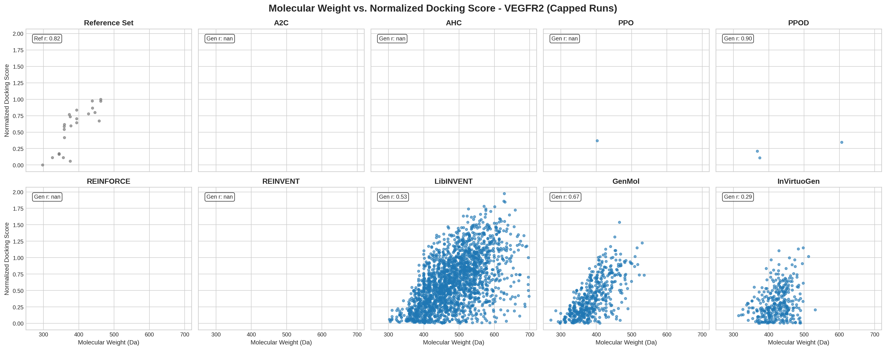
<!-- slide -->
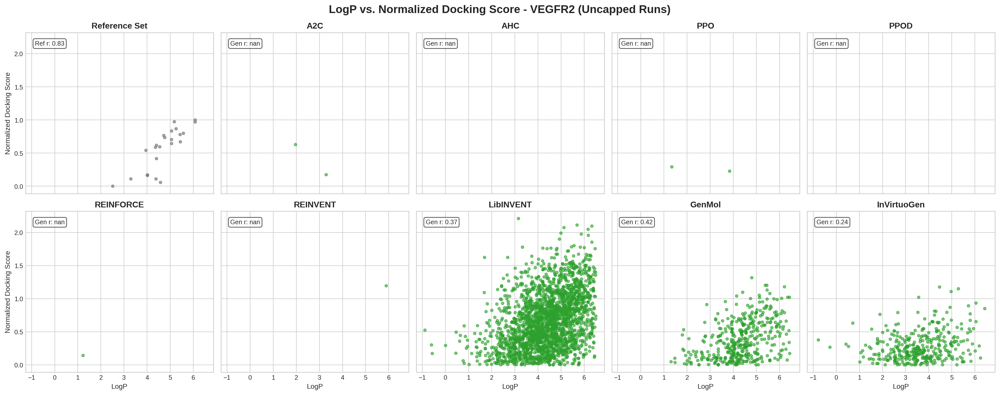
<!-- slide -->
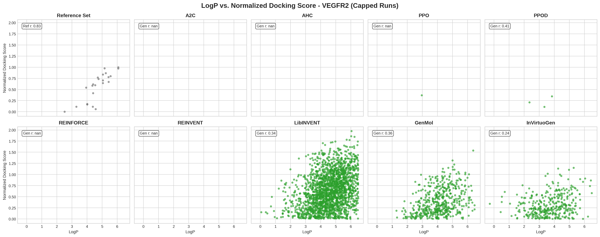
````

#### Statistics Summary
| Model | Experiment Type | N (Gen > 0) | Mean MW (Gen) | Mean MW (Ref) | Mean LogP (Gen) | Mean LogP (Ref) | MW Correlation (Gen r) | MW Correlation (Ref r) | LogP Correlation (Gen r) | LogP Correlation (Ref r) |
| :--- | :--- | :---: | :---: | :---: | :---: | :---: | :---: | :---: | :---: | :---: |
| A2C | Capped | 0 | N/A | 385.9 | N/A | 4.67 | N/A | 0.82 | N/A | 0.83 |
| A2C | Uncapped | 2 | 441.4 | 385.9 | 2.62 | 4.67 | N/A | 0.82 | N/A | 0.83 |
| AHC | Capped | 0 | N/A | 385.9 | N/A | 4.67 | N/A | 0.82 | N/A | 0.83 |
| AHC | Uncapped | 0 | N/A | 385.9 | N/A | 4.67 | N/A | 0.82 | N/A | 0.83 |
| PPO | Capped | 1 | 402.3 | 385.9 | 2.96 | 4.67 | N/A | 0.82 | N/A | 0.83 |
| PPO | Uncapped | 2 | 422.9 | 385.9 | 2.58 | 4.67 | N/A | 0.82 | N/A | 0.83 |
| PPOD | Capped | 3 | 449.5 | 385.9 | 3.18 | 4.67 | 0.90 | 0.82 | 0.41 | 0.83 |
| PPOD | Uncapped | 0 | N/A | 385.9 | N/A | 4.67 | N/A | 0.82 | N/A | 0.83 |
| REINFORCE | Capped | 0 | N/A | 385.9 | N/A | 4.67 | N/A | 0.82 | N/A | 0.83 |
| REINFORCE | Uncapped | 1 | 353.4 | 385.9 | 1.23 | 4.67 | N/A | 0.82 | N/A | 0.83 |
| REINVENT | Capped | 0 | N/A | 385.9 | N/A | 4.67 | N/A | 0.82 | N/A | 0.83 |
| REINVENT | Uncapped | 1 | 507.7 | 385.9 | 5.88 | 4.67 | N/A | 0.82 | N/A | 0.83 |
| LibINVENT | Capped | 2083 | 484.8 | 385.9 | 4.57 | 4.67 | 0.53 | 0.82 | 0.34 | 0.83 |
| LibINVENT | Uncapped | 2270 | 467.4 | 385.9 | 4.37 | 4.67 | 0.57 | 0.82 | 0.37 | 0.83 |
| GenMol | Capped | 505 | 389.1 | 385.9 | 4.10 | 4.67 | 0.67 | 0.82 | 0.36 | 0.83 |
| GenMol | Uncapped | 432 | 397.2 | 385.9 | 4.34 | 4.67 | 0.55 | 0.82 | 0.42 | 0.83 |
| InVirtuoGen | Capped | 345 | 423.1 | 385.9 | 3.71 | 4.67 | 0.29 | 0.82 | 0.24 | 0.83 |
| InVirtuoGen | Uncapped | 352 | 418.1 | 385.9 | 3.60 | 4.67 | 0.35 | 0.82 | 0.24 | 0.83 |

---

